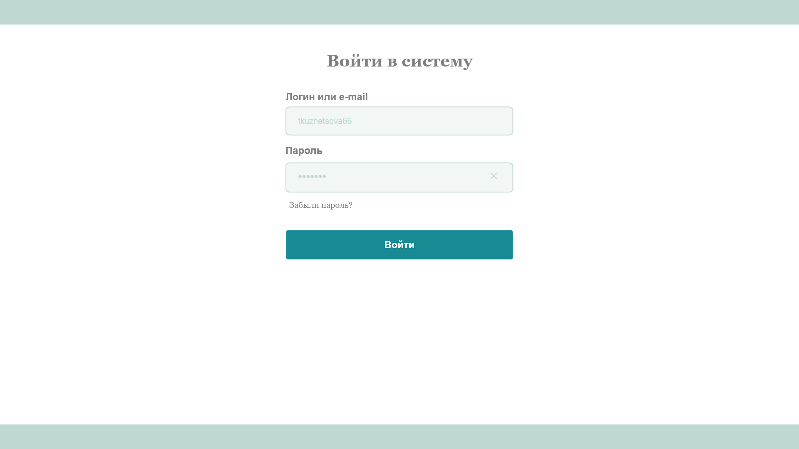
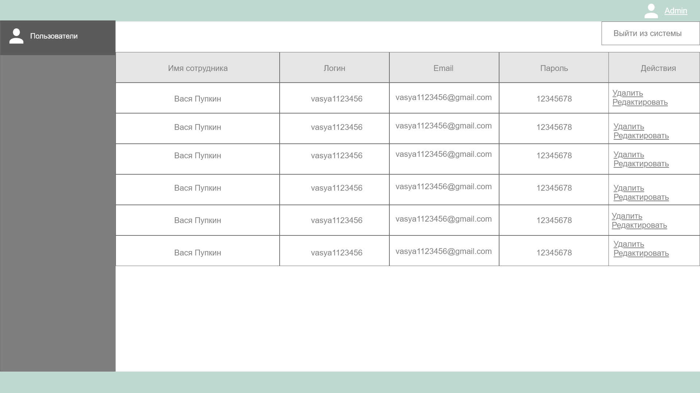
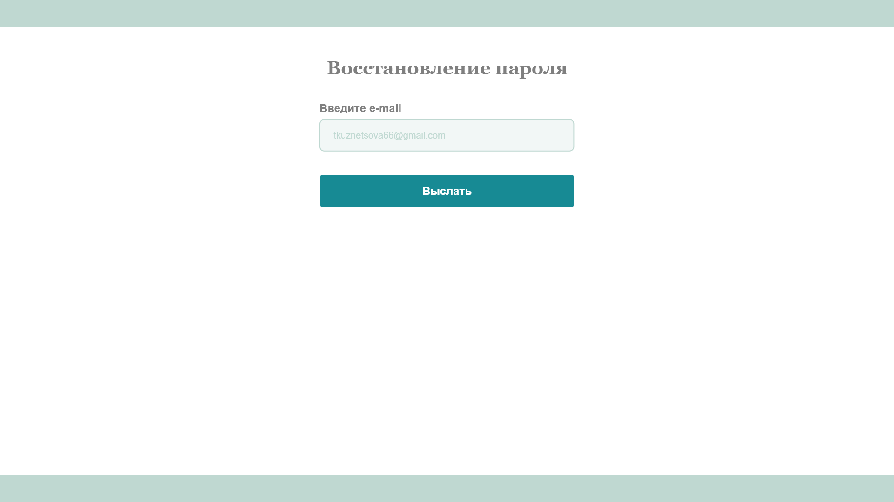
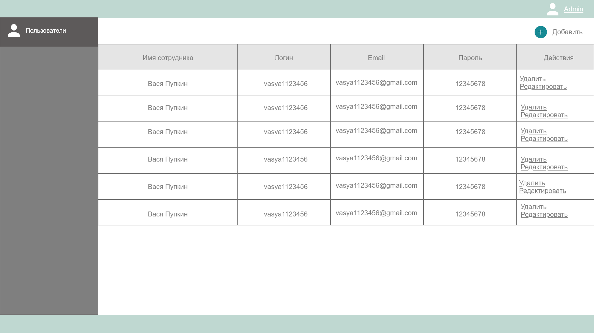
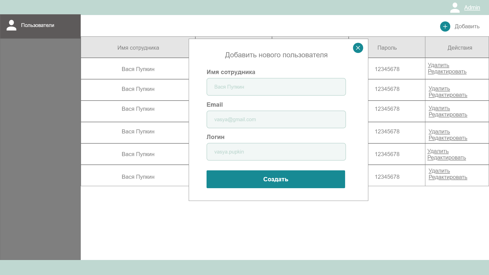
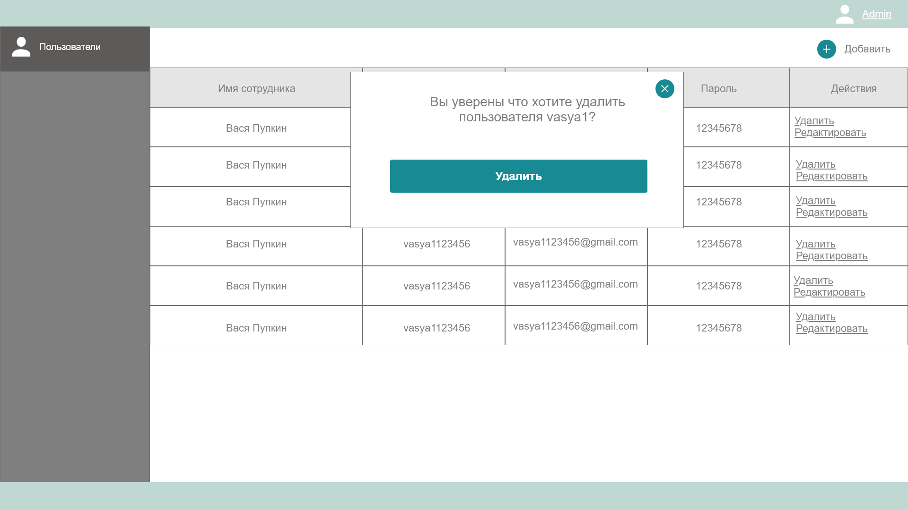
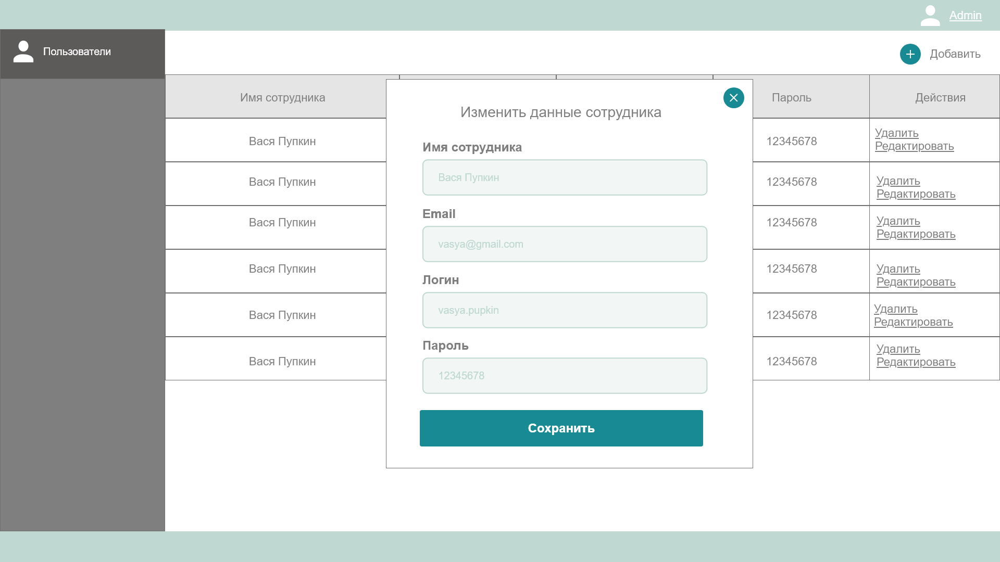

## Изначальная страница

| Флаг | Значение |
|---|---|
| Приоритет | Высокий |
| Риск | Низкий |
| Оценочное время |  |
| Stakeholders | Заказчик |
| Цели | Сделать главную страницу и возможность управлять пользователями для админа |
| Описание | Мы должны сделать изначальную точку доступа, возможность авторизовываться, восстанавливать пароль, для админа - создавать, удалять пользователя, менять ео данные. В дальнейшем к этому функционалу будут добавлять права и доступы для каждого пользователя.|

#### User Flow

1. Видео https://www.screencast.com/t/CA8xcPmfbO4F
2. Файл prototype.pdf
3. Ниже в user stories

#### User Stories

| ID | Role | Description |
|---|---|---|
| 1 | Admin | Администратор системы |
| 2 | User | Пользователь системы |

1. Как админ или пользователь я должен уметь видеть изначальную страницу и поля ввода для авторизации чтобы я смог зайти в систему

2. Как админ или пользователь я должен уметь выйти из системы чтобы я смог зайти в систему под другим аккаунтом

3. Как пользователь я должен уметь получать свой пароль по email если я его забыл чтобы я смог вспомнить свой парольи зайти в систему

4. Как админ я должен уметь видеть список всех пользователей чтобы я смог ими управлять

5. Как админ я должен уметь создать нового пользователя с логином, паролем и email чтобы я мог добавлять новый пользователей в систему

6. Как админ я должен уметь получать авто сгенерированный пароль для нового пользователя, который посылается ему на почту чтобы я мог устанавливать надежные пароли новым пользователям
7. Как админ я должен уметь удалять пользователя чтобы я мог удалять пользователя из системы

8. Как админ я должен уметь редактировать данные пользователя чтобы я мог изменять данные пользователя

#### Acceptance Criteria & Tests (For testing)

| ID | Criteria | Tests |
|---|---|---|
| 1 | Возможность зайти в систему | **1.** Открыть страницу **2.** Ввести логин/пароль **3.** Войти в систему |
| |  | **1.** Открыть страницу **2.** Ввести email/пароль **3.** Войти в систему |
| 2 | Сообщение об ошибке если некорректные данные  | **1.** Открыть страницу **2.** Ввести некорректные логин/пароль **3.** Увидеть сообщение об ошибке |
| | | **1.** Открыть страницу **2.** Ввести некорректные email/пароль **3.** Увидеть сообщение об ошибке |
| 3 | Высылка пароля если забыл | **1.** Открыть страницу **2.** Начать восстановление пароля **3.** Ввести email **4.** Увидеть что пароль пришел по почте |
| 4 | Сообщение об ошибке если восстановление пароля на некорректный email | **1.** Открыть страницу **2.** Начать восстановление пароля **3.** Ввести некорректный email **4.** Увидеть сообщение об ошибке |
| 5 | Увидеть всех пользователей если админ | **1.** Открыть страницу **2.** Ввести данные для админа **3.** Войти в систему и увидеть всех пользователей |
| 6 | Удалить пользователя если админ | **1.** Войти в систему как админ **2.** Выбрать пользователя и удалить его **3.** Проверить что он был удален и больше не может авторизоваться |
| 7 | Редактировать данные пользователя если админ | **1.** Войти в систему как админ **2.** Выбрать пользователя и начать редактирование его данных **3.** Изменить данные и проверить что пользователь может авторизоваться с новыми данными |
| 8 | Создать пользователя если админ | **1.** Войти в систему как админ **2.** Начать создание пользователя **3.** Ввести все данные **4.** Создать пользователя **5.** Проверить что новый пользователь может авторизоваться |
| 9 | Выйти из системы | **1.** Войти в систему  **2.** Выбрать "выйти из системы" **3.** Выйти из системы |
| 10 | Видеть сообщения об о некорректо введенных данных | **1.** Войти в систему как админ  **2.** Начать создавать пользователя **3.** Не ввести некоторые данные либо некорректные **4.** Увидеть сообщение об ошибке |
| | | **1.** Войти в систему как админ  **2.** Начать редактировать пользователя **3.** Не ввести некоторые данные либо некорректные **4.** Увидеть сообщение об ошибке |
